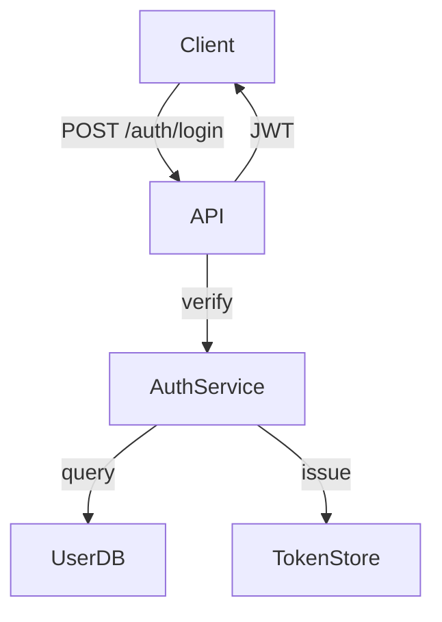
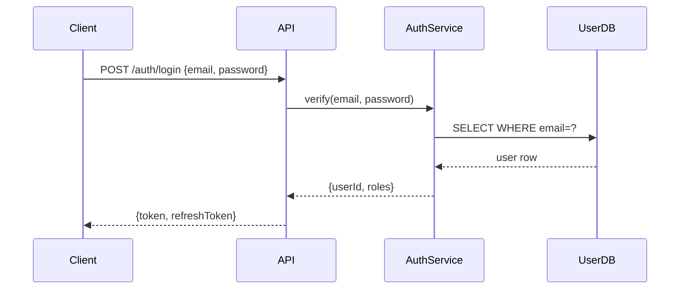
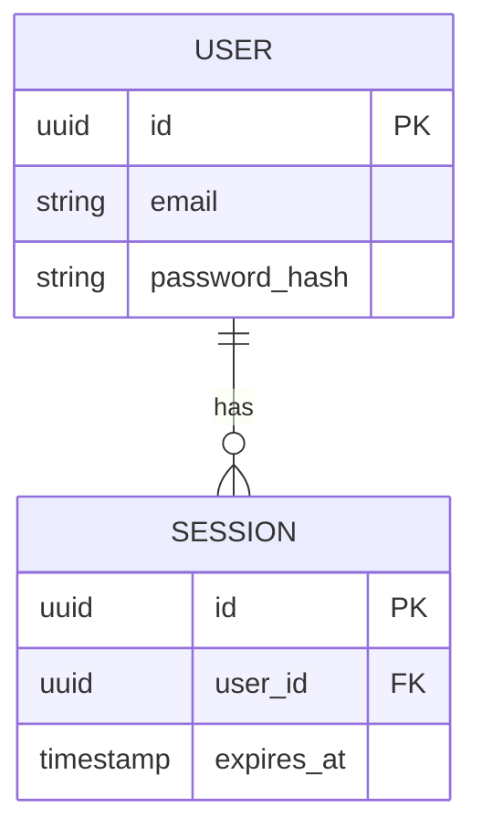

# Architecture Diagram

Include a diagram in every ADR. A diagram communicates structure faster than prose.

## When to use

In the **Decision** or **Data Models** section of an ADR when:
- Multiple components interact
- Data flows through the system
- API contracts need visual clarification

## Mermaid (preferred)

Mermaid renders in GitHub, Obsidian, and most doc tools.

### Component diagram


### Sequence diagram


### Entity diagram


## ASCII fallback

Use when Mermaid isn't supported:

```
[Client] --POST /login--> [API Gateway] --> [Auth Service] --> [User DB]
                                                    |
                                              [Token Store]
```

## Rules

- Label every arrow with the data or action it carries
- Show external systems (DB, third-party APIs) as distinct boxes
- Keep diagrams focused — one concern per diagram
- Don't include implementation details (no method names, no internal variables)
